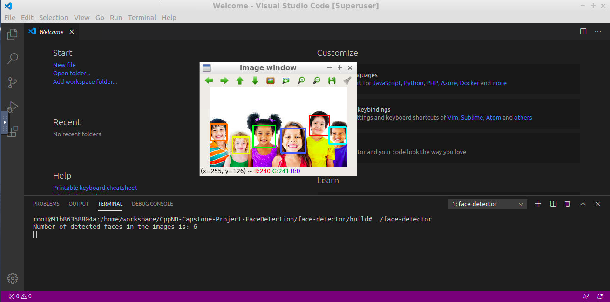

# CppND-Capstone-Project-FaceDetection

This repo contains face detection pipleline implementation as a capstone project for the Udacity C++ Nanodegree.

The facial detection is based on Viola-Jones object detection algorithm which is implemented in OpenCV.

For more information about Viola-Jones algorithms check the following resources [here](https://en.wikipedia.org/wiki/Viola%E2%80%93Jones_object_detection_framework) and [here](https://towardsdatascience.com/the-intuition-behind-facial-detection-the-viola-jones-algorithm-29d9106b6999)




## Cloning

```
git clone https://github.com/AhmedNasr7/CppND-Capstone-Project-FaceDetection
```

## Dependencies 

* cmake >= 3.11.3
  * All OSes: [click here for installation instructions](https://cmake.org/install/)
* make >= 4.1 (Linux, Mac), 3.81 (Windows)
  * Linux: make is installed by default on most Linux distros
  * Mac: [install Xcode command line tools to get make](https://developer.apple.com/xcode/features/)
  * Windows: [Click here for installation instructions](http://gnuwin32.sourceforge.net/packages/make.htm)
* gcc/g++ >= 5.4
  * Linux: gcc / g++ is installed by default on most Linux distros
  * Mac: same instructions as make - [install Xcode command line tools](https://developer.apple.com/xcode/features/)
  * Windows: recommend using [MinGW](http://www.mingw.org/)
* OpenCV >= 4.1
  * The complete installation instructions for all operating systems can be found [here](https://www.learnopencv.com/opencv-installation-on-ubuntu-macos-windows-and-raspberry-pi/)
  * This library must be built from source, The OpenCV 4.1.0 source code can be found [here](https://github.com/opencv/opencv/tree/4.1.0)

## Compiling and Running

### Compiling
To compile the project, first, create a `build` directory and change to that directory:
```
cd face-detector
mkdir build && cd build
```
From within the `build` directory, then run `cmake` and `make` as follows:
```
cmake ..
make
```
### Running
The executable will be placed in the `build` directory. From within `build`, you can run the project as follows:
```
./face-detector


## Project Structure 

* Under the face-detector directory:
	
	* src/facedetector.h
	  * The header file for the facedetector class that encapsulates all the pipeline code.
	  * Contains class data members declarations & class methods prototypes.

	* src/facedetector.cpp
	  * The code file for the facedetector class that encapsulates all the pipeline code.
	  * Contains class methods definitions.

	* src/main.cpp
	  * Program main.
	  * Declare the image path variable.
	  * Instantiate the faceDetector class.
	  * call the object detect method to run the detection algorithm and draw boxes.
	  * call show_img method to show image
	  * print out the number of faces in the image.

